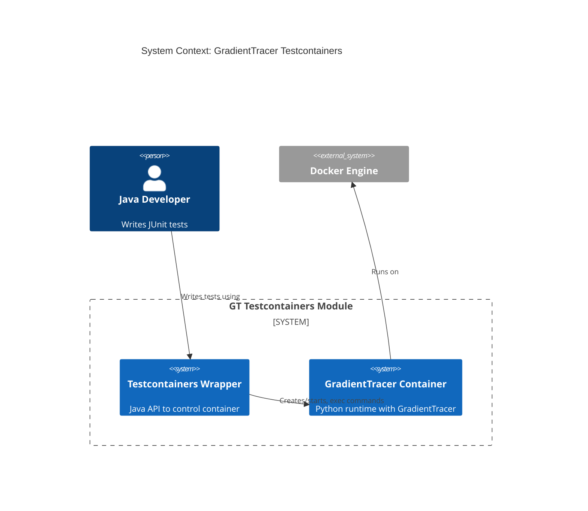

# 3. System Scope and Context

The system under documentation is the Testcontainers module enabling Java tests to orchestrate a containerized GradientTracer (Python) runtime.

## 3.1 Business Context
- Consumers: Java test suites (JUnit/TestNG) in projects that need GradientTracer.
- Inputs: test code calling the container API; optional scripts/resources mounted into the container.
- Outputs: logs, stdout/stderr, exit codes, and artifacts copied from container.

## 3.2 Technical Context

Note: Mermaid C4 diagram requires compatible renderers; if unsupported, consider replacing with a flowchart variant.
