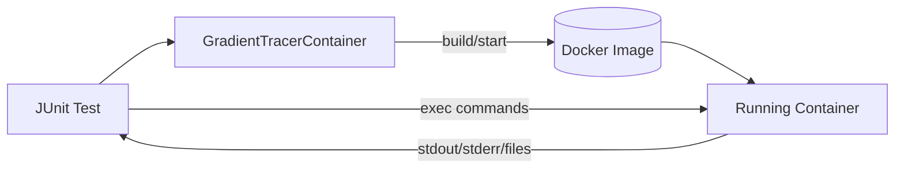

# 4. Solution Strategy

- Use Testcontainers GenericContainer subclass (GradientTracerContainer) for lifecycle and utilities.
- Build image from `docker/Dockerfile` during tests via ImageFromDockerfile to avoid external registry dependence initially.
- Keep container running with a simple Python sleep; exec actual commands per test.
- Provide helper methods (future) to run Python modules/scripts and retrieve outputs.

