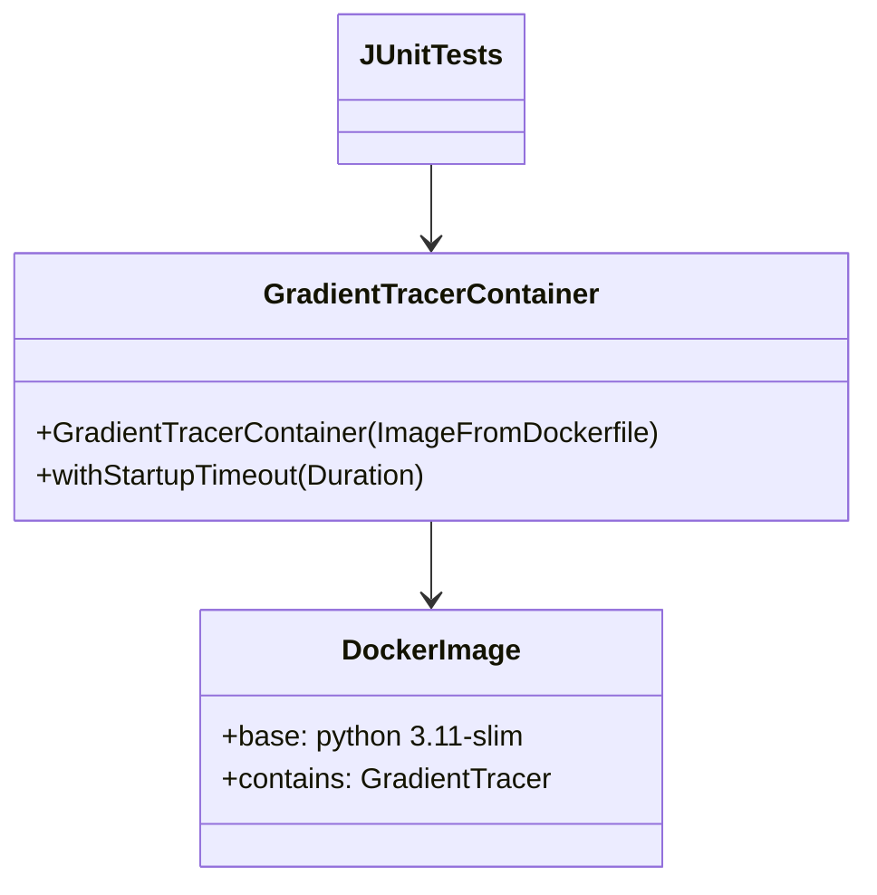

# 5. Building Block View

## 5.1 Whitebox Overall System
- GradientTracerContainer (Java): wraps Testcontainers GenericContainer.
- Dockerfile (container build): defines Python environment with GradientTracer installed.
- JUnit tests: consumers of the container API.

## 5.2 Important Interfaces
- Container exec: `execInContainer("python", ...)` returns stdout/stderr/exit code.
- Build args: `GT_REF` to pin GradientTracer revision.
- Bind mounts (future): mount host files for scripts/data.
