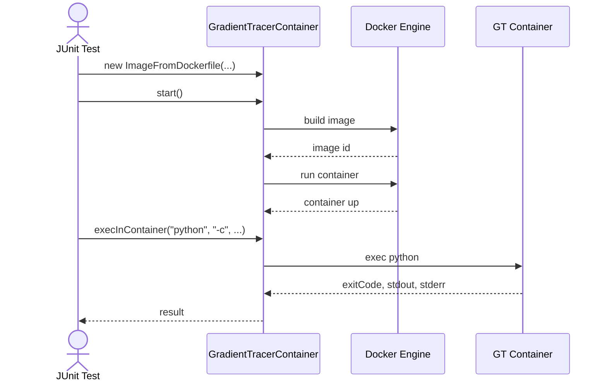

# 6. Runtime View

Example runtime scenario: A JUnit test starts the container and executes a Python one-liner.

```mermaid
sequenceDiagram
  actor Dev as JUnit Test
  participant GTC as GradientTracerContainer
  participant Docker as Docker Engine
  participant C as GT Container

  Dev->>GTC: new ImageFromDockerfile(...)
  Dev->>GTC: start()
  GTC->>Docker: build image
  Docker-->>GTC: image id
  GTC->>Docker: run container
  Docker-->>GTC: container up
  Dev->>GTC: execInContainer("python", "-c", ...)
  GTC->>C: exec python
  C-->>GTC: exitCode, stdout, stderr
  GTC-->>Dev: result
```
