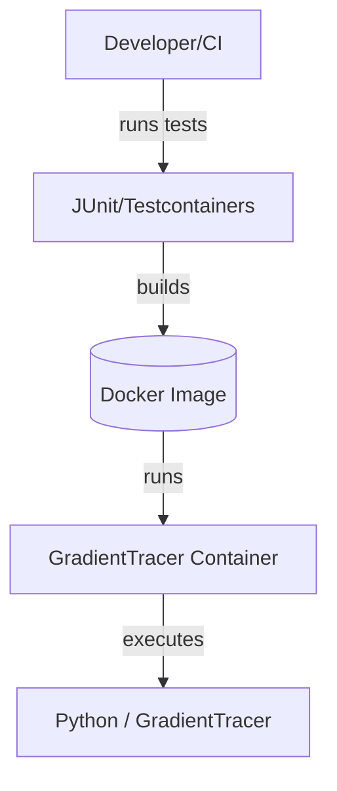

# 7. Deployment View

The solution runs a single container per test or per test class, built from the local Dockerfile by default.

- Nodes:
  - Developer/CI: machine with Docker engine.
  - Docker Image: python:3.11-slim based image with GradientTracer installed.
  - GradientTracer Container: runtime environment for test executions.

- Deployment concerns:
  - CPU-only by default; potential GPU via NVIDIA runtime in the future.
  - Network isolation via Testcontainers networks if needed.
